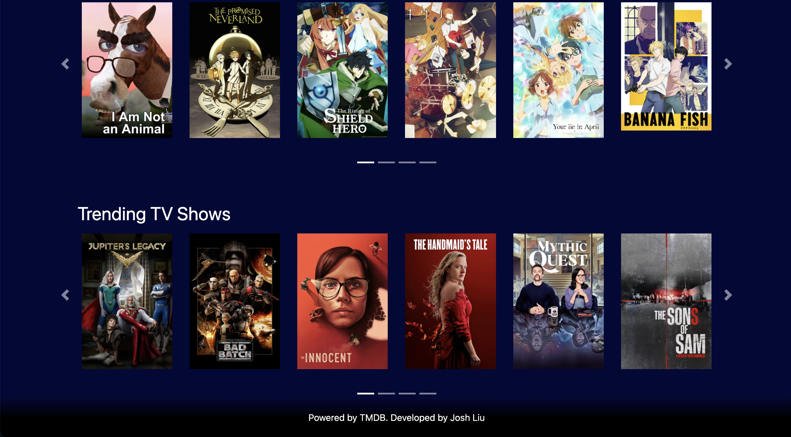
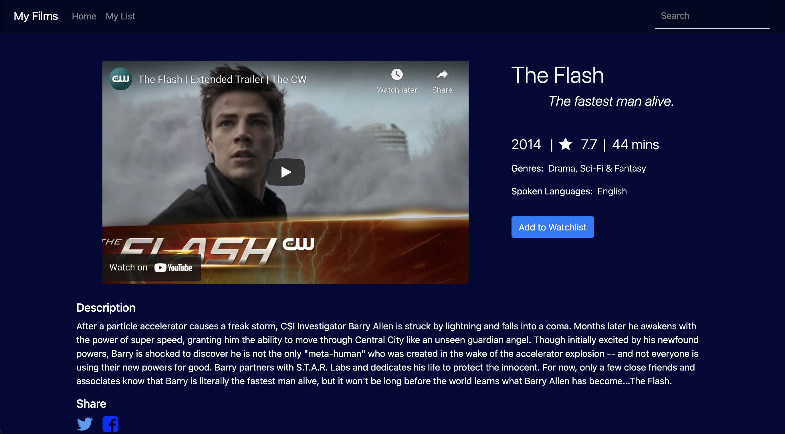
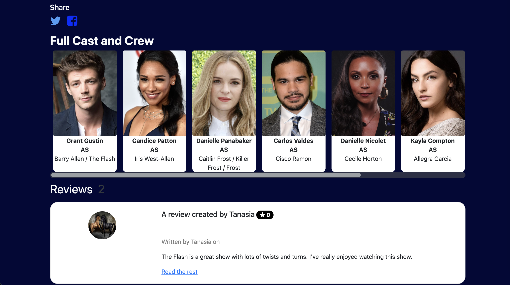
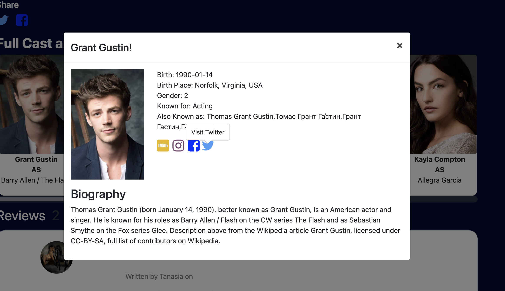
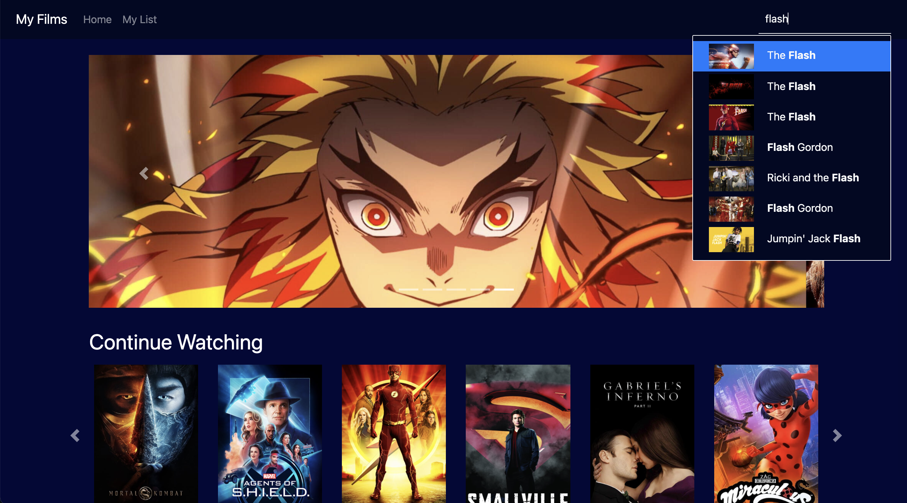
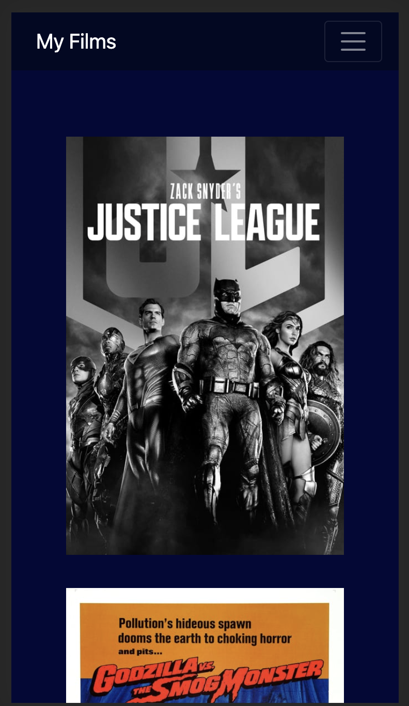
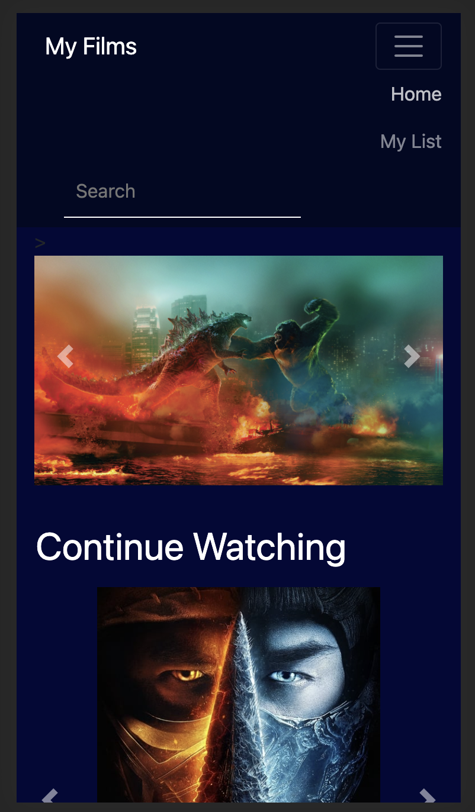

# [My Films - another films website](https://cs571-310200.uc.r.appspot.com/)

Responsive website displays trending/top rated/popular movies and tv shows and search functionalities with films casts/reviews/recommendations, powered by [TMDB](https://www.themoviedb.org/) live on [Here](https://cs571-310200.uc.r.appspot.com/) (might take a while to activate the container).  
Link: https://cs571-310200.uc.r.appspot.com/

## Table of contents

- [General info](#general-info)
- [Technologies](#technologies)
- [Screen Shots](#screenshots)
- [Setup](#setup)

## General info

1. Home page displays trending movies and tv shows
2. Search pages can search for any movie and tv shows and view the detail (casts, reviews, poster)
3. Display detail of the casts, teaser, reviews, recommendations of the film
4. Fully responsive, use localstorage to store the continue watchlist

## Technologies

Project is created with:

- Angular/Typescript
- Node/Express/Bootstrap
- GCP

## Screen Shots










## Setup

To run this project, install it locally using node:

```
$ yarn install
$ yarn start
```
